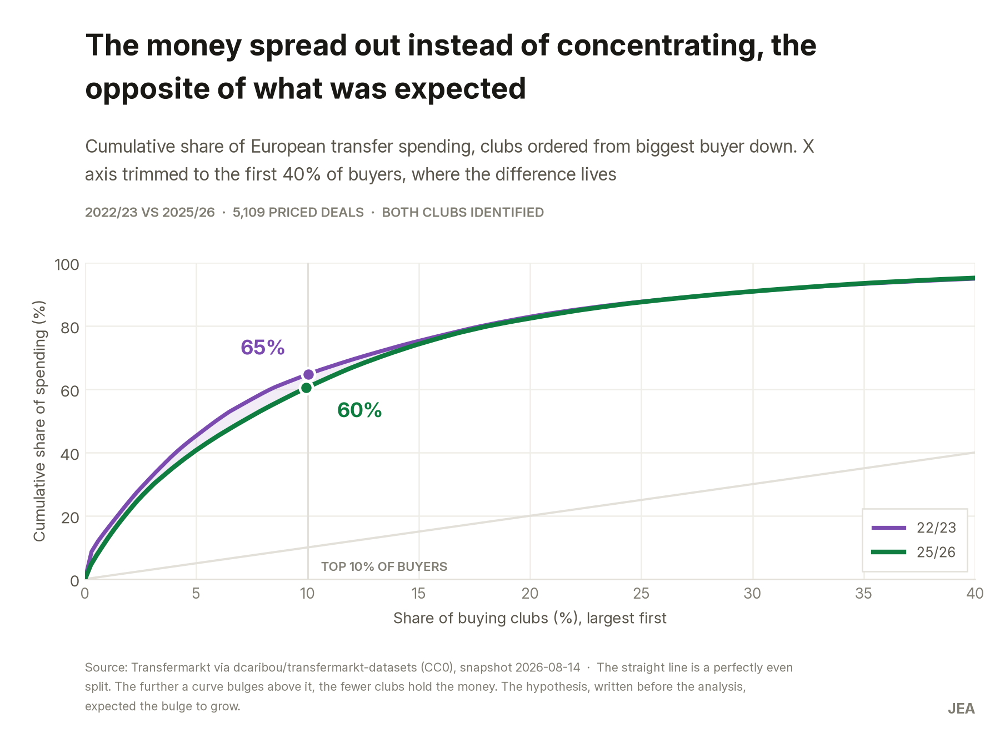
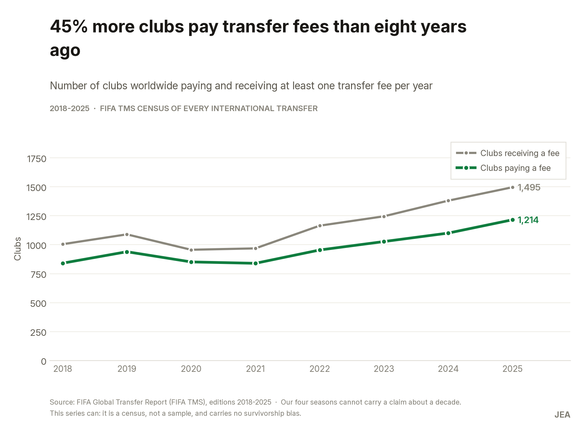
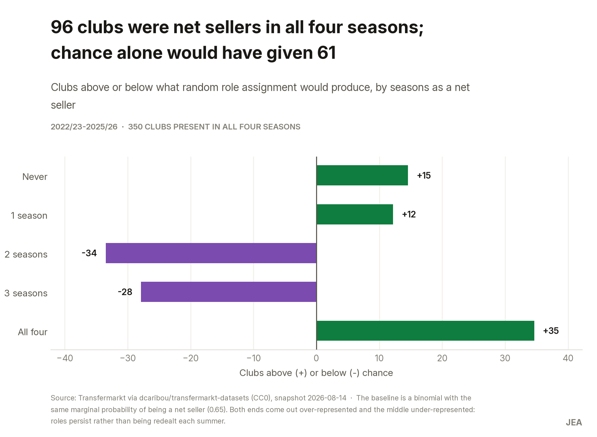
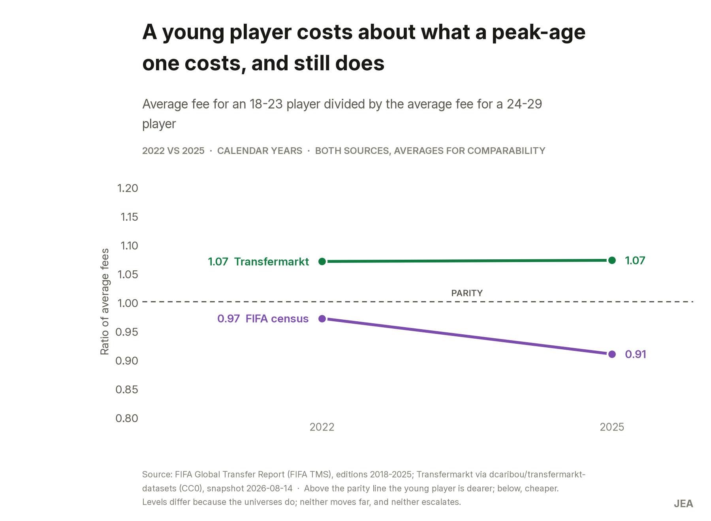
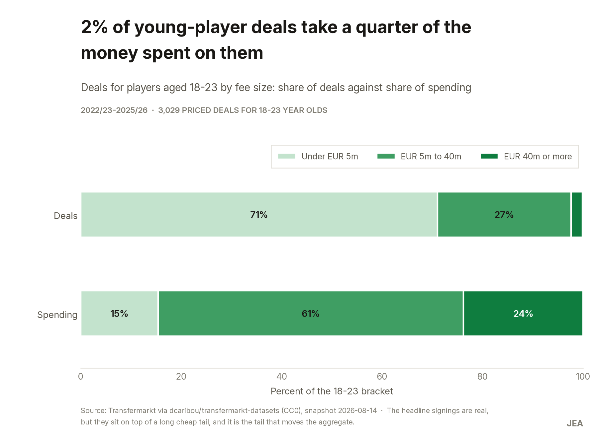

# Football's transfer money is spreading out, not concentrating — and youth carries no premium

> Two things the industry treats as settled turn out to be wrong. The ten largest buying clubs went
> from **32.1% to 26.7%** of European transfer spending in four seasons, while the number of clubs
> buying at all rose from 339 to 382. And an 18–23 player costs **about what a 24–29 player costs**,
> a ratio near 1.0 that does not escalate in either of two independent sources.
>
> Both were written down as a hypothesis **before** the analysis, and both were contradicted by it.

`SQL` `DuckDB` `2 sources` `6,716 priced transfers` `€37.4bn`

This repository is the case's evidence layer: the phase-by-phase log, the cleaning log, source
records, the queries and the reproducible pipeline. The narrative version — context, process and
findings written for a reader rather than for a reviewer — goes on
[juanesportfolio.com](https://juanesportfolio.com/) when the case is published.

---

## The question

A multi-club investment fund has to decide where its next tranche of capital goes: into a
developing club that sells talent, or into an elite one that buys it. The answer depends on whether
the money really is concentrating, and on whether the premium paid for young players justifies
funding an academy over buying a squad.

**Client is fictional; the analysis is not.**

## What the data says

**The money is spreading out.** Not an English effect — excluding English buyers the top-10 share
still falls, 30.6% → 24.0%. Not a four-season blip either: FIFA's census shows 45% more clubs
paying transfer fees in 2025 than in 2018.




**Selling is a position, not a bad year.** 202 of 350 clubs were net sellers in three or more of
the four seasons, 96 in all four — against 61 that chance alone would produce. Ajax banked €267m
net, Salzburg €234m, Lille €185m; Chelsea (−€800m) and Manchester United (−€672m) never once
finished a season as net sellers.



**Youth carries no premium — but the young market runs at two speeds.** Deals of €40m or more are
2.3% of young-player transactions and take 23.8% of the money; the 71% under €5m account for 15%.




## Recommendations

| # | Action | Evidence | Impact / effort |
|---|---|---|---|
| R1 | Put the next tranche into a persistent net seller in a mid-tier league, not an elite club | 96 clubs net sellers in all four seasons against 61 by chance; 45% more buyers than in 2018 | High / medium |
| R2 | Cap prices against the market band; write into the mandate that age carries no premium | Youth/peak fee ratio at parity in both sources, not escalating | High / low |
| R3 | Make each club pick its lane: cheap volume or elite few | 2.3% of young deals take 23.8% of the bracket's money | Medium / medium |

Full cards with impact, metric, risk and assumption: [`entregables/recomendaciones.md`](entregables/recomendaciones.md).
Executive summary: [`entregables/resumen_ejecutivo.md`](entregables/resumen_ejecutivo.md).

## Data, and what it cannot answer

| Source | Job | Period | Licence |
|---|---|---|---|
| [FIFA Global Transfer Report](https://inside.fifa.com/legal/football-regulatory/player-transfers/tms-reports) (FIFA TMS) | The decade series and the age axis | 2016–2025 market · 2018–2025 by age | FIFA publication; figures transcribed with citation, PDFs not redistributed |
| [`dcaribou/transfermarkt-datasets`](https://github.com/dcaribou/transfermarkt-datasets) | Deal-level detail: clubs, players, fees | 22/23–25/26 | CC0-1.0 |

**The limitation that shaped everything else:** Transfermarkt rebuilds each player's history from
players present in the base *today*, so coverage thins going backwards **and differentially by
age** — mean age of priced deals drifts 20.8 → 24.4 and the 18–21 share falls 53.8% → 21.2% for
reasons that have nothing to do with football. Taken at face value it answers the opposite of the
hypothesis. Hence the four-season window, and hence every decade claim being sourced to FIFA's
census instead.

Also declared: no claim is made about the *level or direction* of youth spending share (the sources
disagree and the gap doubles in 2025); nothing here is causal; under-18s are not analysable at 2–7
priced deals a season; and net transfer income is not profit.

## How it was built

SQL on DuckDB — four tables to join, a window to select, a categorisation to apply, and a rebuild
that needs no server and no account. Queries live in [`consultas/`](consultas/) as real `.sql`
files rather than inside Python strings, so they can be read and judged on their own.

Nothing needed correcting in the raw data: no duplicates, no impossible ages, no self-transfers.
Every transformation is a *selection*, and the checks that came back empty are recorded anyway —
in [`bitacora-limpieza.md`](bitacora-limpieza.md) — because an unrecorded check is
indistinguishable from a check never run.

Full phase-by-phase log and every decision that could have gone another way: [`CASO.md`](CASO.md).

## Reproduce

```bash
git clone https://github.com/BobbyTarantino099/football-transfer-market.git
cd football-transfer-market
pip install -r requirements.txt

# No download needed: the raw snapshot is in datos/crudos/, frozen because the upstream
# dataset refreshes weekly. SHA-256 of each file is in documentacion/fichas-de-fuente.md.
python notebooks/procesar.py    # runs consultas/01 and 02 -> datos/limpios/*.duckdb
python notebooks/analizar.py    # runs consultas/03 to 06  -> salidas/tablas/
python notebooks/verificar.py   # the analysis checks
python notebooks/graficos.py    # the figures -> salidas/graficos/
python notebooks/build_docx.py  # the executive summary
```

`procesar.py` prints the row reconciliation for every transformation and then checks the result
against the figures that closed phase 2, exiting with an error if they do not match. A pipeline
that finishes without complaining is not the same as a pipeline that is correct.

---

*Fictional client, real analysis. Data from FIFA TMS and Transfermarkt.*
